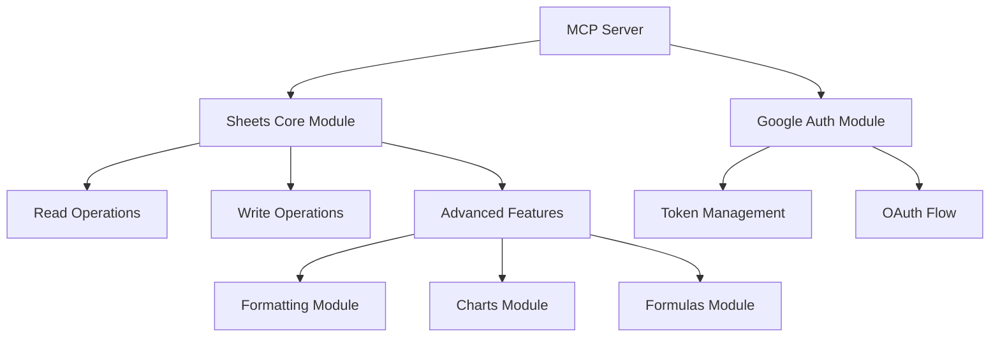

# Google Sheets MCP Server

## Overview
A Python 3.9-based MCP server that provides advanced integration with Google Sheets, including reading/writing data, formatting, charts, and formula management.

## Architecture



## Core Components

### 1. MCP Server Core
- Implements the MCP protocol using Python 3.9
- Handles request/response formatting
- Manages tool registration and execution
- Provides error handling and logging

### 2. Authentication Module
- Manages OAuth 2.0 authentication with Google APIs
- Handles token refresh and storage
- Uses existing credentials from environment variables
- Provides secure access to Google Sheets API

### 3. Sheets Core Module
- Base functionality for interacting with Google Sheets
- Spreadsheet and worksheet management
- Cell and range access patterns
- Batch operations for efficiency

### 4. Advanced Features
- **Formatting Module**: Cell styling, conditional formatting, number formats
- **Charts Module**: Creation and management of various chart types
- **Formulas Module**: Formula application, validation, and array formulas

## MCP Tools

### Sheet Management
| Tool Name | Description | Parameters |
|-----------|-------------|------------|
| `create_sheet` | Create new spreadsheet or worksheet | `title`, `sheet_type`, `parent_id` (optional) |
| `get_sheet_info` | Get metadata about sheets | `spreadsheet_id`, `include_sheets` (boolean) |
| `manage_permissions` | Control access and sharing | `spreadsheet_id`, `permissions` (object) |

### Data Operations
| Tool Name | Description | Parameters |
|-----------|-------------|------------|
| `read_range` | Read data from specified ranges | `spreadsheet_id`, `range`, `value_render_option` (optional) |
| `write_range` | Write data to specified ranges | `spreadsheet_id`, `range`, `values`, `value_input_option` |
| `append_rows` | Add data to the end of sheets | `spreadsheet_id`, `range`, `values`, `insert_data_option` |
| `clear_range` | Remove data from ranges | `spreadsheet_id`, `range` |

### Formatting
| Tool Name | Description | Parameters |
|-----------|-------------|------------|
| `format_cells` | Apply styling to cells/ranges | `spreadsheet_id`, `range`, `format_options` (object) |
| `add_conditional_format` | Create conditional formatting rules | `spreadsheet_id`, `range`, `rule_type`, `rule_values` |
| `merge_cells` | Combine cells into merged regions | `spreadsheet_id`, `range`, `merge_type` |
| `set_number_format` | Apply number formatting | `spreadsheet_id`, `range`, `number_format` |

### Charts
| Tool Name | Description | Parameters |
|-----------|-------------|------------|
| `create_chart` | Generate new charts | `spreadsheet_id`, `sheet_id`, `chart_type`, `data_range`, `options` |
| `update_chart` | Modify existing charts | `spreadsheet_id`, `sheet_id`, `chart_id`, `update_options` |
| `get_chart_data` | Retrieve chart information | `spreadsheet_id`, `sheet_id`, `chart_id` |
| `position_chart` | Adjust chart placement | `spreadsheet_id`, `sheet_id`, `chart_id`, `position` |

### Formulas
| Tool Name | Description | Parameters |
|-----------|-------------|------------|
| `apply_formula` | Add formulas to cells | `spreadsheet_id`, `range`, `formula` |
| `apply_array_formula` | Add array formulas | `spreadsheet_id`, `range`, `formula` |
| `create_named_range` | Define named ranges for formulas | `spreadsheet_id`, `range`, `name`, `scope` (optional) |

## Authentication Flow

1. Use existing OAuth credentials from environment variables
2. Implement token refresh mechanism
3. Store tokens securely
4. Handle authentication errors gracefully

## Implementation Details

### Dependencies
- Python 3.9+
- MCP SDK
- Google API Python Client
- OAuth2Client

### File Structure
```
google_sheets_mcp/
├── src/
│   ├── __init__.py
│   ├── server.py           # Main MCP server implementation
│   ├── auth.py             # Authentication module
│   ├── sheets/
│   │   ├── __init__.py
│   │   ├── core.py         # Core sheets functionality
│   │   ├── data_ops.py     # Data operations
│   │   ├── formatting.py   # Formatting operations
│   │   ├── charts.py       # Chart operations
│   │   └── formulas.py     # Formula operations
│   └── utils/
│       ├── __init__.py
│       ├── validators.py   # Input validation
│       └── converters.py   # Data conversion utilities
├── tests/                  # Unit tests
├── examples/               # Usage examples
├── README.md               # Project documentation
└── setup.py                # Package configuration
```

## Usage Examples

### Reading Data
```python
# Example of using the read_range tool
response = mcp_client.call_tool(
    server_name="google_sheets",
    tool_name="read_range",
    arguments={
        "spreadsheet_id": "1BxiMVs0XRA5nFMdKvBdBZjgmUUqptlbs74OgvE2upms",
        "range": "Sheet1!A1:D10"
    }
)
```

### Formatting Cells
```python
# Example of using the format_cells tool
response = mcp_client.call_tool(
    server_name="google_sheets",
    tool_name="format_cells",
    arguments={
        "spreadsheet_id": "1BxiMVs0XRA5nFMdKvBdBZjgmUUqptlbs74OgvE2upms",
        "range": "Sheet1!A1:D10",
        "format_options": {
            "backgroundColor": {"red": 1.0, "green": 0.0, "blue": 0.0},
            "textFormat": {"bold": True, "fontSize": 12}
        }
    }
)
```

### Creating a Chart
```python
# Example of using the create_chart tool
response = mcp_client.call_tool(
    server_name="google_sheets",
    tool_name="create_chart",
    arguments={
        "spreadsheet_id": "1BxiMVs0XRA5nFMdKvBdBZjgmUUqptlbs74OgvE2upms",
        "sheet_id": 0,
        "chart_type": "BAR",
        "data_range": "Sheet1!A1:B10",
        "options": {
            "title": "Sales Data",
            "legend": {"position": "BOTTOM"}
        }
    }
)
